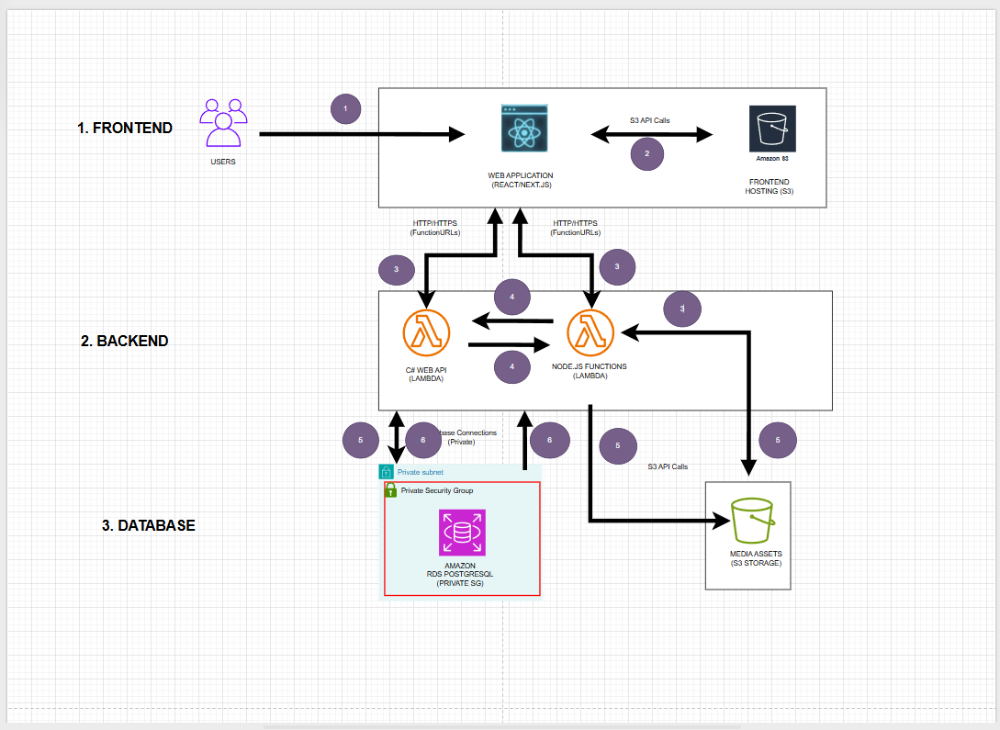

## 5.1 Tổng quan dự án & Sơ đồ kiến trúc

### 1. Bối cảnh bài toán thực tế

Trong quản lý kí túc xá và phòng trọ lớn, các hệ thống luôn phải trực tuyến 24/7 để tiếp nhận yêu cầu đặt phòng của sinh viên, báo hỏng thiết bị, hoặc phục vụ việc đối soát hóa đơn điện nước và thanh toán.
Tuy nhiên, lượng truy cập vào ban đêm và các khung giờ học tập thường cực kỳ thấp. Việc duy trì máy chủ truyền thống chạy liên tục gây ra sự lãng phí rất lớn về mặt ngân sách (ước tính khoảng $15 - $40/tháng đối với các máy chủ cấu hình trung bình).

Dự án **SmartDorm** giải quyết triệt để bài toán này bằng cách áp dụng mô hình điện toán không máy chủ (**Serverless**) trên nền tảng AWS, giúp chi phí vận hành giảm về mức **gần như 0 USD/tháng** ở quy mô chạy thử nghiệm.

### 2. Sơ đồ kiến trúc chi tiết (Architecture Diagram)

Dưới đây là sơ đồ luồng dữ liệu và thiết kế phân vùng mạng an toàn của hệ thống:

### 3. Nguyên lý hoạt động của các dịch vụ sử dụng:

* **AWS Amplify**: Hỗ trợ lưu trữ và triển khai giao diện người dùng (Frontend), đồng thời tích hợp dịch vụ xác thực.
* **Amazon Cognito**: Quản lý định danh người dùng, cung cấp tính năng đăng ký, đăng nhập bảo mật.
* **Amazon Bedrock (AgentCore Runtime & Nova 2 Sonic)**: Đóng vai trò là bộ não AI (Agent Runtime) điều phối luồng xử lý và gọi mô hình ngôn ngữ lớn (LLM) Nova 2 Sonic để xử lý nghiệp vụ thông minh.
* **Amazon Bedrock (AgentCore Gateway)**: Cổng dịch vụ Model Context Protocol (MCP) giúp kết nối AI Agent với các API và công cụ bên ngoài.
* **Amazon API Gateway & AWS Lambda**: Bộ đôi xử lý tính toán Serverless, nhận yêu cầu từ AI Agent và thực thi mã nghiệp vụ.
* **Amazon DynamoDB**: Cơ sở dữ liệu NoSQL lưu trữ dữ liệu hoạt động của hệ thống với tốc độ truy xuất cực nhanh.
* **Amazon Location Service**: Cung cấp các dịch vụ bản đồ, định vị và địa lý.
* **Amazon Bedrock AgentCore Runtime Build Pipeline (AWS CDK, S3, CodeBuild, ECR)**: Quy trình tự động hóa CI/CD giúp đóng gói và triển khai mã nguồn của Agent lên môi trường AWS.
* **Security & Monitoring (AWS KMS & CloudWatch)**: Mã hóa khóa bảo mật và giám sát, ghi nhận nhật ký (logs) hoạt động của toàn bộ hệ thống.
