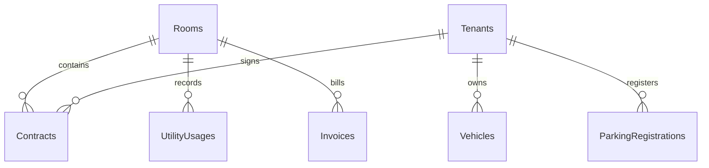

# 5.4 Thiết kế Cơ sở dữ liệu PostgreSQL & cấu hình EF Core

Một hệ thống quản lý ký túc xá hoạt động trơn tru đòi hỏi một cơ sở dữ liệu quan hệ được chuẩn hóa. Trong bài lab này, chúng ta sử dụng hệ quản trị cơ sở dữ liệu mạnh mẽ **PostgreSQL** chạy trên **Amazon RDS** và công cụ ORM hiện đại **Entity Framework Core (EF Core)** để thực hiện việc ánh xạ các thực thể lập trình sang các bảng vật lý dưới cơ sở dữ liệu.

---

### 1. Phân tích Sơ đồ thực thể chính (ERD Schema)

Kiến trúc cơ sở dữ liệu SmartDorm được chia thành các bảng có mối quan hệ chặt chẽ:



*   **Rooms (Bảng Phòng):** Quản lý thông tin mã phòng, loại phòng (đơn/đôi/tập thể), đơn giá phòng mặc định và trạng thái hiện tại (`Available`, `Occupied`, `Maintenance`).
*   **Tenants (Bảng Khách thuê/Sinh viên):** Quản lý thông tin hồ sơ cá nhân của sinh viên, thông tin liên lạc, email dùng để gửi hóa đơn và trường `AvatarUrl` lưu trữ đường dẫn ảnh đại diện/CCCD trên Amazon S3.
*   **Contracts (Bảng Hợp đồng):** Bản ghi trung gian liên kết giữa một `Tenant` và một `Room` cụ thể. Quản lý các trường: ngày bắt đầu thuê, ngày hết hạn hợp đồng, số tiền đặt cọc và trạng thái hiệu lực (`Active`, `Expired`, `Terminated`).
*   **UtilityUsages (Bảng Chỉ số điện nước):** Lưu trữ chỉ số điện và nước ghi nhận vào đầu tháng và cuối tháng của từng phòng để làm căn cứ tính tiền.
*   **Invoices (Bảng Hóa đơn):** Bảng tổng hợp chi phí hàng tháng của từng phòng, bao gồm: tiền phòng cố định, tiền điện nước tiêu thụ thực tế (được tính toán tự động dựa trên hiệu số tiêu thụ của UtilityUsages nhân với đơn giá định mức), chi phí gửi xe và trạng thái thanh toán (`Paid`, `Unpaid`, `Overdue`).

---

### 2. Cấu hình DbContext trong Backend (`AppDbContext.cs`)

Lớp `AppDbContext` kế thừa từ `DbContext` của Entity Framework Core, hoạt động như một Gateway quản lý kết nối và thực hiện các câu lệnh truy vấn dữ liệu. 

Một cấu hình vô cùng quan trọng ở đây là việc sử dụng phương thức `HasConversion<string>()` nhằm chuyển đổi toàn bộ kiểu dữ liệu **Enum** trong mã nguồn C# thành chuỗi văn bản (String) khi lưu trữ xuống các cột trong PostgreSQL, thay vì lưu trữ dạng số nguyên mặc định (Integer). Việc này giúp cơ sở dữ liệu dễ đọc hiểu, đối soát lỗi trực tiếp qua pgAdmin hoặc psql CLI dễ dàng hơn:

```csharp
using System;
using Microsoft.EntityFrameworkCore;
using SmartDorm.Api.Models;

namespace SmartDorm.Api.Data
{
    public class AppDbContext : DbContext
    {
        public AppDbContext(DbContextOptions<AppDbContext> options) : base(options) {}

        // Ánh xạ các DbSet sang các bảng tương ứng trong CSDL PostgreSQL
        public DbSet<User> Users { get; set; } = null!;
        public DbSet<Tenant> Tenants { get; set; } = null!;
        public DbSet<Room> Rooms { get; set; } = null!;
        public DbSet<Contract> Contracts { get; set; } = null!;
        public DbSet<Invoice> Invoices { get; set; } = null!;
        public DbSet<UtilityUsage> UtilityUsages { get; set; } = null!;
        public DbSet<Vehicle> Vehicles { get; set; } = null!;
        public DbSet<ParkingRegistration> ParkingRegistrations { get; set; } = null!;

        protected override void OnModelCreating(ModelBuilder modelBuilder)
        {
            base.OnModelCreating(modelBuilder);

            // Cấu hình lưu trữ kiểu Enum dưới dạng String trong PostgreSQL
            modelBuilder.Entity<User>()
                .Property(e => e.Role)
                .HasConversion<string>();

            modelBuilder.Entity<Room>()
                .Property(e => e.Status)
                .HasConversion<string>();

            modelBuilder.Entity<Contract>()
                .Property(e => e.Status)
                .HasConversion<string>();

            modelBuilder.Entity<Invoice>()
                .Property(e => e.Status)
                .HasConversion<string>();

            // Cấu hình Fluent API định nghĩa rõ ràng các mối quan hệ khóa ngoại (Foreign Key)
            modelBuilder.Entity<Contract>()
                .HasOne(c => c.Room)
                .WithMany()
                .HasForeignKey(c => c.RoomId)
                .OnDelete(DeleteBehavior.Restrict); // Ngăn chặn việc xóa phòng khi đang có hợp đồng hoạt động

            modelBuilder.Entity<Contract>()
                .HasOne(c => c.Tenant)
                .WithMany()
                .HasForeignKey(c => c.TenantId)
                .OnDelete(DeleteBehavior.Cascade);  // Tự động xóa hợp đồng nếu hồ sơ sinh viên bị xóa
        }
    }
}
```

---

### 3. Quy trình chạy các câu lệnh Migrations thiết lập Database

Để khởi tạo cấu trúc cơ sở dữ liệu trên máy tính cá nhân (môi trường Local Development) hoặc đẩy lên máy chủ đám mây AWS RDS thực tế, bạn thực thi các bước sau thông qua giao diện dòng lệnh EF Core CLI:

#### Bước 1: Cài đặt công cụ Entity Framework Core CLI toàn cục
Mở terminal và thực thi lệnh để cài đặt công cụ dòng lệnh EF Core:
```bash
dotnet tool install --global dotnet-ef
```

#### Bước 2: Cập nhật chuỗi kết nối cục bộ (Local Connection String)
Mở tệp [appsettings.Development.json](file:///m:/SmartDorm/backend/appsettings.Development.json) và điều chỉnh thông số chuỗi kết nối trỏ đến PostgreSQL local của bạn:
```json
{
  "ConnectionStrings": {
    "DefaultConnection": "Host=localhost;Database=smartdorm;Username=postgres;Password=YOUR_LOCAL_DB_PASSWORD;Port=5432"
  }
}
```

#### Bước 3: Tạo mã nguồn bản ghi cấu trúc Database (Create Migration)
Tại thư mục chứa dự án backend `backend/`, thực thi lệnh tạo migration để EF Core quét qua toàn bộ cấu trúc các Models và tự động tạo các tệp mã nguồn C# thiết lập bảng:
```bash
dotnet ef migrations add InitialCreate
```

#### Bước 4: Áp dụng và tạo các bảng trực tiếp lên Database vật lý
Thực thi lệnh sau để EF Core biên dịch mã nguồn Migration và tự động thực thi các truy vấn SQL tạo bảng, ràng buộc khóa ngoại trực tiếp lên PostgreSQL:
```bash
dotnet ef database update
```

> [!TIP]
> **Cách chạy nhanh cơ sở dữ liệu bằng File SQL có sẵn:**
> Nếu bạn muốn khởi tạo cấu trúc nhanh chóng mà không cần chạy các lệnh migration của EF Core, bạn cũng có thể mở công cụ quản trị CSDL pgAdmin hoặc psql CLI và thực thi trực tiếp nội dung tệp tin kịch bản cơ sở dữ liệu đã biên soạn sẵn tại [database.sql](file:///m:/SmartDorm/database.sql).
